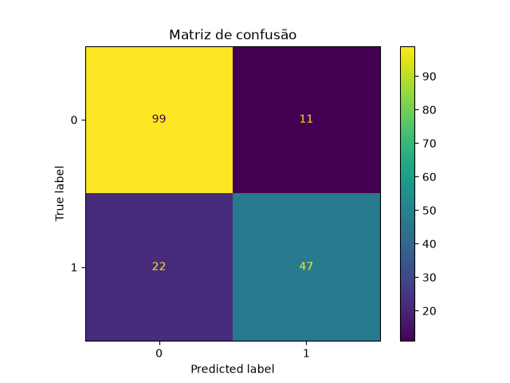

# Titanic Survival Prediction — Machine Learning Project


> 🚧 **Projeto em desenvolvimento**
>
> Este projeto está sendo construído gradualmente, com foco no aprendizado dos fundamentos de Machine Learning e na evolução de um notebook para uma aplicação organizada, reproduzível e preparada para receber uma API.

## Sobre o projeto

Este é um projeto de portfólio baseado no desafio **Titanic: Machine Learning from Disaster**.

O problema consiste em utilizar informações sobre os passageiros para construir um modelo capaz de prever se uma pessoa sobreviveu ou não ao naufrágio.

O projeto começou com uma Análise Exploratória de Dados em Jupyter Notebook e está sendo transformado, passo a passo, em um pequeno projeto de **Machine Learning Engineering**.

O fluxo planejado é:

```text
Dados
  ↓
Análise exploratória
  ↓
Preparação dos dados
  ↓
Treinamento do modelo
  ↓
Avaliação
  ↓
Modelo salvo
  ↓
Script de previsão
  ↓
API de previsão
  ↓
Testes e Docker
```

## Objetivo

O objetivo principal é desenvolver uma solução de classificação que responda à seguinte pergunta:

> **Com base nas características de um passageiro, é possível prever se ele sobreviveu ao Titanic?**

Além da previsão, o projeto busca praticar:

- análise e preparação de dados;
- separação entre características e variável-alvo;
- engenharia de atributos;
- treinamento e avaliação de modelos;
- organização de código Python fora do notebook;
- criação de um processo de treinamento reproduzível;
- persistência e reutilização de modelos treinados;
- disponibilização futura do modelo por meio de uma API;
- testes automatizados e conteinerização.

## Conceito central

Neste projeto:

```python
X = características utilizadas para fazer a previsão
y = resposta que o modelo precisa aprender
```

A variável-alvo é:

```python
y = dados["Survived"]
```

Onde:

- `0` representa um passageiro que não sobreviveu;
- `1` representa um passageiro que sobreviveu.

Algumas das características utilizadas em `X` são idade, sexo, classe da passagem, tarifa e porto de embarque.

## Fonte dos dados

Os dados utilizados neste projeto foram obtidos no Kaggle:

**Dataset utilizado:** [Titanic: Machine Learning from Disaster](https://www.kaggle.com/datasets/shuofxz/titanic-machine-learning-from-disaster)

O projeto utiliza os seguintes arquivos:

| Arquivo | Finalidade |
|---|---|
| `train.csv` | Dados usados para treinamento e avaliação, incluindo a coluna `Survived` |
| `test.csv` | Dados sem a coluna `Survived`, utilizados para gerar previsões |

### Como obter os dados

1. Acesse a página do dataset no Kaggle;
2. entre em sua conta;
3. faça o download dos arquivos;
4. extraia o conteúdo;
5. coloque `train.csv` e `test.csv` dentro da pasta `data/`.

Os caminhos esperados são:

```text
data/train.csv
data/test.csv
```

> Os arquivos CSV não são versionados neste repositório. Isso evita enviar dados brutos ao GitHub e mantém o repositório mais leve.

## Principais variáveis

| Variável | Descrição |
|---|---|
| `Survived` | Indica se o passageiro sobreviveu |
| `Pclass` | Classe da passagem |
| `Sex` | Sexo registrado |
| `Age` | Idade |
| `SibSp` | Quantidade de irmãos, irmãs ou cônjuges a bordo |
| `Parch` | Quantidade de pais ou filhos a bordo |
| `Fare` | Valor pago pela passagem |
| `Embarked` | Porto de embarque |

## Engenharia de atributos

Foram criadas duas novas características:

| Atributo | Descrição |
|---|---|
| `FamilySize` | Quantidade total de pessoas da família, incluindo o passageiro |
| `IsAlone` | Indica se o passageiro viajava sozinho |

O tamanho da família é calculado por:

```python
FamilySize = SibSp + Parch + 1
```

O número `1` representa o próprio passageiro.

A criação dessas características foi retirada do notebook e colocada em `src/features.py`, permitindo que a transformação seja reutilizada no treinamento, nas previsões e, futuramente, na API.

## Pré-processamento

As características foram divididas em dois grupos.

### Numéricas

- `Age`;
- `SibSp`;
- `Parch`;
- `Fare`;
- `FamilySize`;
- `IsAlone`.

O tratamento numérico utiliza:

- `SimpleImputer` com a mediana para preencher valores ausentes;
- `StandardScaler` para colocar as variáveis em escalas comparáveis.

### Categóricas

- `Pclass`;
- `Sex`;
- `Embarked`.

O tratamento categórico utiliza:

- `SimpleImputer` com a categoria mais frequente;
- `OneHotEncoder` para converter categorias em colunas numéricas.

O `ColumnTransformer` aplica o tratamento correto a cada grupo de colunas.

## Modelo inicial

O primeiro algoritmo utilizado foi a **Regressão Logística**, adequada para um problema de classificação binária.

O conjunto `train.csv` foi dividido em:

- 80% para treinamento;
- 20% para validação.

O parâmetro `stratify=y` mantém proporções semelhantes de sobreviventes e não sobreviventes nas duas partes.

O pré-processamento e a Regressão Logística foram reunidos em um único objeto `Pipeline`. Dessa forma, o mesmo tratamento aprendido durante o treinamento será aplicado automaticamente aos dados utilizados em previsões futuras.

## Resultados do modelo

A Regressão Logística obteve **81,56% de acurácia** no conjunto de validação, composto por 179 passageiros.

| Classe | Precision | Recall | F1-score | Registros |
|---|---:|---:|---:|---:|
| Não sobreviveu | 0,82 | 0,90 | 0,86 | 110 |
| Sobreviveu | 0,81 | 0,68 | 0,74 | 69 |

O modelo apresentou melhor desempenho na identificação dos passageiros que não sobreviveram, alcançando recall de **90%** nessa classe.

Para os sobreviventes, o recall foi de **68%**, indicando que o modelo ainda possui maior dificuldade para reconhecer essa classe.

### Matriz de confusão

A matriz de confusão mostra os acertos e erros do modelo no conjunto de validação:



O modelo classificou corretamente:

- 99 passageiros que não sobreviveram;
- 47 passageiros que sobreviveram.

Os erros foram:

- 11 passageiros classificados como sobreviventes, mas que não sobreviveram;
- 22 passageiros classificados como não sobreviventes, mas que sobreviveram.

No total, o modelo acertou 146 dos 179 casos de validação. O principal ponto de melhoria é reduzir os 22 falsos negativos da classe `Sobreviveu`.

## Pipeline treinado

Após o treinamento, o pipeline completo é salvo com `joblib` em:

```text
models/titanic_pipeline.joblib
```

Esse arquivo contém, em um único objeto:

- preenchimento dos valores ausentes;
- padronização das variáveis numéricas;
- codificação das variáveis categóricas;
- Regressão Logística treinada.

Isso permite carregar o pipeline posteriormente e realizar previsões sem executar novamente todo o treinamento.

## Etapa atual

O arquivo `src/train.py` já executa pelo terminal:

```text
carregamento dos dados
        ↓
engenharia de atributos
        ↓
separação de X e y
        ↓
divisão entre treino e validação
        ↓
pipeline de pré-processamento e modelo
        ↓
treinamento da Regressão Logística
        ↓
previsões e avaliação
        ↓
salvamento com joblib
```

A próxima etapa será criar `src/predict.py` para carregar `models/titanic_pipeline.joblib` e fazer previsões sem treinar o modelo novamente.

## Checklist do projeto

### Fundamentos e análise de dados

- [x] Criar o repositório e a estrutura inicial
- [x] Configurar ambiente virtual e dependências
- [x] Baixar os dados no Kaggle
- [x] Carregar os arquivos `train.csv` e `test.csv`
- [x] Identificar tipos de dados e valores ausentes
- [x] Verificar registros duplicados
- [x] Produzir estatísticas descritivas
- [x] Analisar sobrevivência por sexo, classe, idade e embarque
- [x] Criar visualizações e interpretações

### Modelo no Jupyter Notebook

- [x] Definir `X` e `y`
- [x] Criar `FamilySize` e `IsAlone`
- [x] Separar dados de treino e validação
- [x] Tratar valores ausentes
- [x] Codificar variáveis categóricas
- [x] Criar um pipeline com Scikit-learn
- [x] Treinar uma Regressão Logística
- [x] Avaliar o modelo
- [x] Realizar validação cruzada
- [x] Gerar previsões para o conjunto de teste
- [x] Gerar o arquivo `submission.csv`

### Organização para Machine Learning Engineering

- [x] Criar o pacote `src/`
- [x] Mover a engenharia de atributos para `src/features.py`
- [x] Criar o arquivo `src/train.py`
- [x] Carregar os dados pelo script de treinamento
- [x] Separar as características `X` e a variável-alvo `y`
- [x] Separar treino e validação no `src/train.py`
- [x] Criar o pré-processamento no script
- [x] Treinar o modelo pelo terminal
- [x] Calcular e exibir acurácia
- [x] Gerar o relatório de classificação
- [x] Gerar e salvar a matriz de confusão
- [x] Unir pré-processamento e modelo em um único `Pipeline`
- [x] Salvar o pipeline treinado com `joblib`
- [ ] Criar um script para carregar o modelo e fazer previsões
- [ ] Validar os dados recebidos para previsão
- [ ] Criar uma API com FastAPI
- [ ] Criar testes automatizados com Pytest
- [ ] Criar um `Dockerfile`
- [ ] Documentar a execução da API

### Melhorias opcionais

- [ ] Comparar Regressão Logística, Árvore de Decisão e Random Forest
- [ ] Ajustar hiperparâmetros com validação cruzada
- [ ] Extrair títulos da coluna `Name`
- [ ] Investigar informações de `Cabin` e `Ticket`
- [ ] Analisar a importância das características
- [ ] Registrar o resultado obtido no Kaggle

## Estrutura atual

```text
titanic-machine-learning-from-disaster/
├── data/
│   ├── train.csv
│   └── test.csv
├── notebooks/
│   ├── 01_analise_exploratoria.ipynb
│   └── 02_modelo_machine_learning.ipynb
├── src/
│   ├── __init__.py
│   ├── features.py
│   └── train.py
├── images/
│   └── matriz_de_confusao.png
├── models/
│   └── titanic_pipeline.joblib
├── app/                       # API em uma etapa futura
├── tests/                     # Testes automatizados em uma etapa futura
├── .gitignore
├── README.md
└── requirements.txt
```

## Notebooks

- [Análise exploratória](notebooks/01_analise_exploratoria.ipynb)
- [Modelo de Machine Learning](notebooks/02_modelo_machine_learning.ipynb)

## Tecnologias utilizadas

- Python
- Pandas
- NumPy
- Matplotlib
- Scikit-learn
- Joblib
- Jupyter Notebook
- Git e GitHub

Tecnologias planejadas:

- FastAPI
- Pydantic
- Pytest
- Docker

## Como executar

### 1. Clone o repositório

```bash
git clone https://github.com/israelgoncalvesx/titanic-machine-learning-from-disaster.git
cd titanic-machine-learning-from-disaster
```

### 2. Crie e ative um ambiente virtual

No Windows PowerShell:

```powershell
python -m venv .venv
.\.venv\Scripts\Activate.ps1
```

No Linux ou macOS:

```bash
python3 -m venv .venv
source .venv/bin/activate
```

### 3. Instale as dependências

```bash
python -m pip install -r requirements.txt
```

### 4. Baixe e adicione os dados

Baixe os arquivos na [página do dataset no Kaggle](https://www.kaggle.com/datasets/shuofxz/titanic-machine-learning-from-disaster) e coloque-os em:

```text
data/train.csv
data/test.csv
```

### 5. Execute o treinamento

Na raiz do projeto:

```bash
python -m src.train
```

Esse comando:

- prepara os dados;
- treina o pipeline;
- exibe as métricas de avaliação;
- mostra a matriz de confusão;
- salva o pipeline em `models/titanic_pipeline.joblib`.

## Limitações atuais

- O conjunto de dados é pequeno;
- a coluna `Cabin` possui muitos valores ausentes;
- o primeiro modelo utiliza apenas uma parte das informações disponíveis;
- ainda não existe um script separado para carregar o pipeline e realizar novas previsões;
- a API, os testes e o Docker ainda não foram implementados;
- o recall dos sobreviventes ainda pode ser melhorado;
- o desempenho no conjunto oficial de teste depende da avaliação realizada pelo Kaggle.

## Transparência sobre o uso de Inteligência Artificial

Este projeto foi desenvolvido com o auxílio de ferramentas de Inteligência Artificial, utilizadas para esclarecer dúvidas, revisar conceitos, organizar etapas e melhorar a documentação.

O código é executado, estudado e revisado pelo autor. As decisões, interpretações e conclusões são verificadas durante o processo de aprendizagem.

## Autor

**Israel Gabriel Gonçalves Almeida dos Santos**

- [LinkedIn](https://www.linkedin.com/in/israelgoncalvesx)
- [GitHub](https://github.com/israelgoncalvesx)